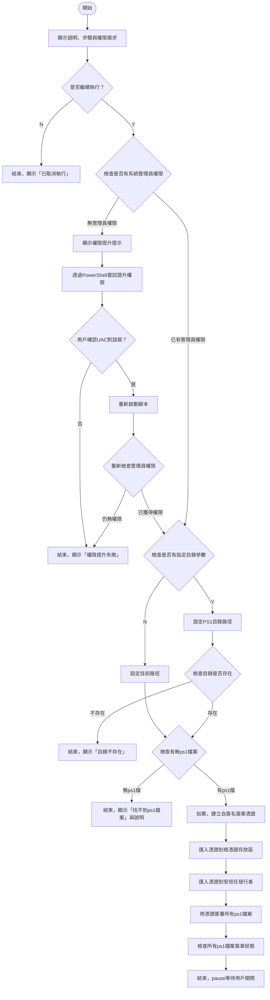

```mermaid
flowchart TD
    Start([開始])
    Desc[顯示說明、步驟與權限需求]
    UserInput{是否繼續執行？}
    Cancel[結束，顯示「已取消執行」]
    
    CheckAdmin{檢查是否有系統管理員權限}
    ShowPrompt[顯示權限提升提示]
    Elevate[透過PowerShell嘗試提升權限]
    UACConfirm{用戶確認UAC對話框？}
    Restart[重新啟動腳本]
    CheckAdmin2{重新檢查管理員權限}
    ElevateFail[結束，顯示「權限提升失敗」]
    
    ParamCheck{檢查是否有指定目錄參數}
    SetDir[設定PS1目錄路徑]
    SetCurDir[設定目前路徑]
    CheckDir{檢查目錄是否存在}
    ErrNoDir[結束，顯示「目錄不存在」]
    CheckPs1{檢查有無ps1檔案}
    ErrNoPs1[結束，顯示「找不到ps1檔案」與說明]
    MakeCert[如需，建立自簽名簽章憑證]
    ImportRoot[匯入憑證到根憑證存放區]
    ImportPublisher[匯入憑證到受信任發行者]
    SignFiles[用憑證簽署所有ps1檔案]
    CheckSign[檢查所有ps1檔案簽章狀態]
    Done[結束，pause等待用戶關閉]

    Start --> Desc --> UserInput
    UserInput -- N --> Cancel
    UserInput -- Y --> CheckAdmin

    CheckAdmin -- 無管理員權限 --> ShowPrompt --> Elevate --> UACConfirm
    UACConfirm -- 是 --> Restart --> CheckAdmin2
    UACConfirm -- 否 --> ElevateFail

    CheckAdmin2 -- 仍無權限 --> ElevateFail
    CheckAdmin2 -- 已獲得權限 --> ParamCheck

    CheckAdmin -- 已有管理員權限 --> ParamCheck

    ParamCheck -- Y --> SetDir --> CheckDir
    ParamCheck -- N --> SetCurDir --> CheckPs1

    CheckDir -- 不存在 --> ErrNoDir
    CheckDir -- 存在 --> CheckPs1

    CheckPs1 -- 無ps1檔 --> ErrNoPs1
    CheckPs1 -- 有ps1檔 --> MakeCert

    MakeCert --> ImportRoot --> ImportPublisher --> SignFiles --> CheckSign --> Done
```
