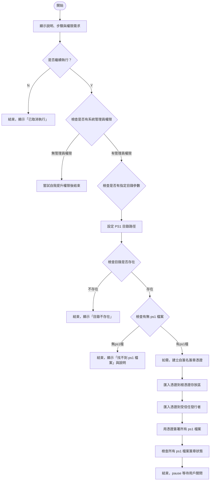

```mermaid
flowchart TD
    Start([開始])
    Desc[顯示說明、步驟與權限需求]
    UserInput{是否繼續執行？}
    Cancel[結束，顯示「已取消執行」]
    CheckAdmin{檢查是否有系統管理員權限}
    Elevate[嘗試自我提升權限後結束]
    ParamCheck{檢查是否有指定目錄參數}
    SetDir[設定 PS1 目錄路徑]
    CheckDir{檢查目錄是否存在}
    ErrNoDir[結束，顯示「目錄不存在」]
    CheckPs1{檢查有無 ps1 檔案}
    ErrNoPs1[結束，顯示「找不到 ps1 檔案」與說明]
    MakeCert[如需，建立自簽名簽章憑證]
    ImportRoot[匯入憑證到根憑證存放區]
    ImportPublisher[匯入憑證到受信任發行者]
    SignFiles[用憑證簽署所有 ps1 檔案]
    CheckSign[檢查所有 ps1 檔案簽章狀態]
    Done[結束，pause 等待用戶關閉]

    Start --> Desc --> UserInput
    UserInput -- N --> Cancel
    UserInput -- Y --> CheckAdmin
    CheckAdmin -- 無管理員權限 --> Elevate
    CheckAdmin -- 有管理員權限 --> ParamCheck
    ParamCheck --> SetDir
    SetDir --> CheckDir
    CheckDir -- 不存在 --> ErrNoDir
    CheckDir -- 存在 --> CheckPs1
    CheckPs1 -- 無ps1檔 --> ErrNoPs1
    CheckPs1 -- 有ps1檔 --> MakeCert
    MakeCert --> ImportRoot --> ImportPublisher --> SignFiles --> CheckSign --> Done
```
